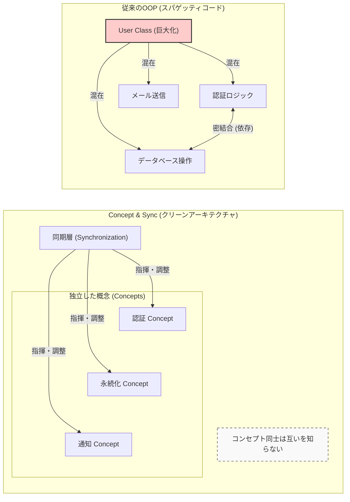

# AI螺旋(Spiral)設計スキル (MIT C&S Edition) - User Guide

> **「AIを150万人使わせる側」ではなく、「AIと共に150年続くシステムを構築する側」へ。**

このドキュメントは、本リポジトリで公開しているエージェント用スキル [./SKILL.md](./SKILL.md) の背景思想と使い方を解説したものです。

## 1. 開発の背景：確率論の限界
現代のAIは非常に有能ですが、その本質は「確率論的な計算機」です。
AIに「それっぽいコード」を書かせて満足していると、いつの間にかモジュール間が複雑に絡み合い、人間にもAIにも制御不能な「知性の不良債権」が積み上がります。

このプロトコルは、MITの Daniel Jackson 教授らが提唱する論文 **"What You See Is What It Does: A Structural Pattern for Legible Software"** の知見を、現代のAIエージェント（Antigravity, Claude code等）に直接「インストール」可能な形式に構成し直したものです。

## 2. コア・コンセプト：Concepts & Synchronizations
このプロトコルの核は、ソフトウェアを以下の2つの要素だけで捉え直すことにあります。

- **Concepts (概念)**: 
    - 完全に独立した「部品」です。お互いの存在を知りません。
    - メリット：ある部品を変更しても、他の部品が壊れることが構造的にあり得なくなります。
- **Synchronizations (同期)**: 
    - 部品同士を繋ぐ「糊（のり）」です。「いつ、どこで、何をするか」というルールを宣言的に記述します。
    - メリット：プログラムの挙動（ビジネスロジック）がこの層に集約されるため、AIの「迷走」を検知しやすくなります。

### 視覚的な比較: OOP vs Concept & Sync

## 3. 使い方
1.  本リポジトリの `skills/ai-spiral-design/` フォルダを、ご自身のAIのスキルフォルダ（`.agent/skills/` 等）へコピーしてください。
2.  コーディングを開始する前に、AIに「MIT C&S プロトコルをロードして（またはSpiral設計を適用して）」と指示してください。
3.  AIは自動的に、この厳格な設計思想に基づいたコード生成を開始します。

## 4. 免責事項（Disclaimer）
- **元ネタ**: MIT Daniel Jackson et al. [論文リンク](https://arxiv.org/html/2508.14511v2)
- **注意**: このスキルはバックドアやマルウェアではありませんが、AIの自由度を奪い、厳格な設計を強いるものです。「とりあえず動けばいい」というVibe Codingには不向きです。

## 5. 適材適所：このスキルの限界
本プロトコルは、AIエージェントが「迷走」するのを防ぐための**「論理の建築学」**です。しかし、万能ではありません。

- **向いていること**:
    - AIエージェント（Antigravity等）をメインに使った個人開発。
    - 複雑なビジネスロジックや、頻繁に仕様が変わるツールの構築。
    - 「AIに任せすぎて中身が分からなくなる」のを防ぎたい時。
- **向いていないこと**:
    - **大規模なゲーム開発**: 極限のパフォーマンス（FPS）を求める場合、同期層のオーバーヘッドが無視できません。
    - **高速な物理計算**: 直接オブジェクトを読み書きする「オブジェクト指向 (OOP)」や「データ指向 (ECS)」の方が適しています。
    - **大企業の標準開発システム**: 既存の強力な規約やパターンがある場合は、それを優先してください。

AIコーディング時代に初めてプログラミングに触れた方にとって、この「螺旋」は強力な味方になりますが、ハードウェアに近い領域や、極北の速度を求める場合は、伝統的な「オブジェクト指向」の扉を叩くことをお勧めします。
