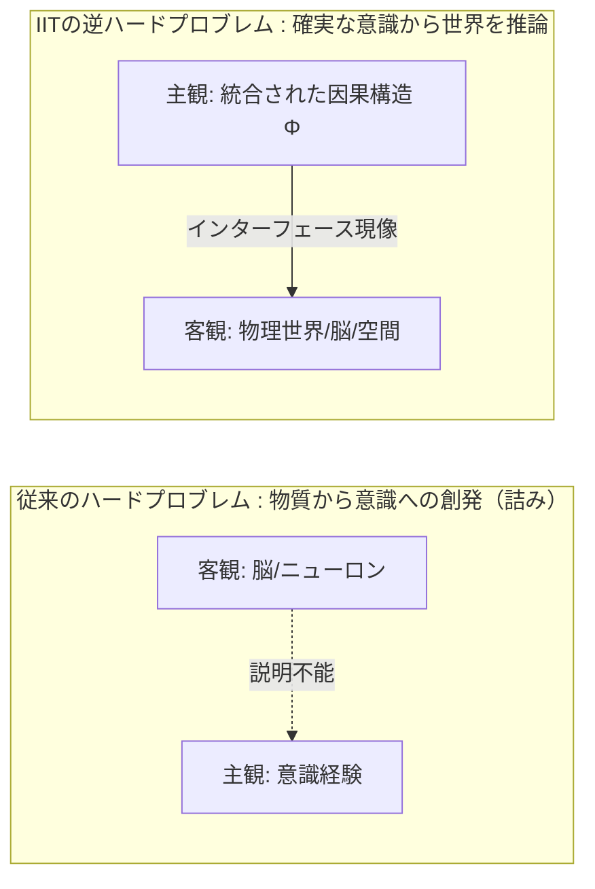
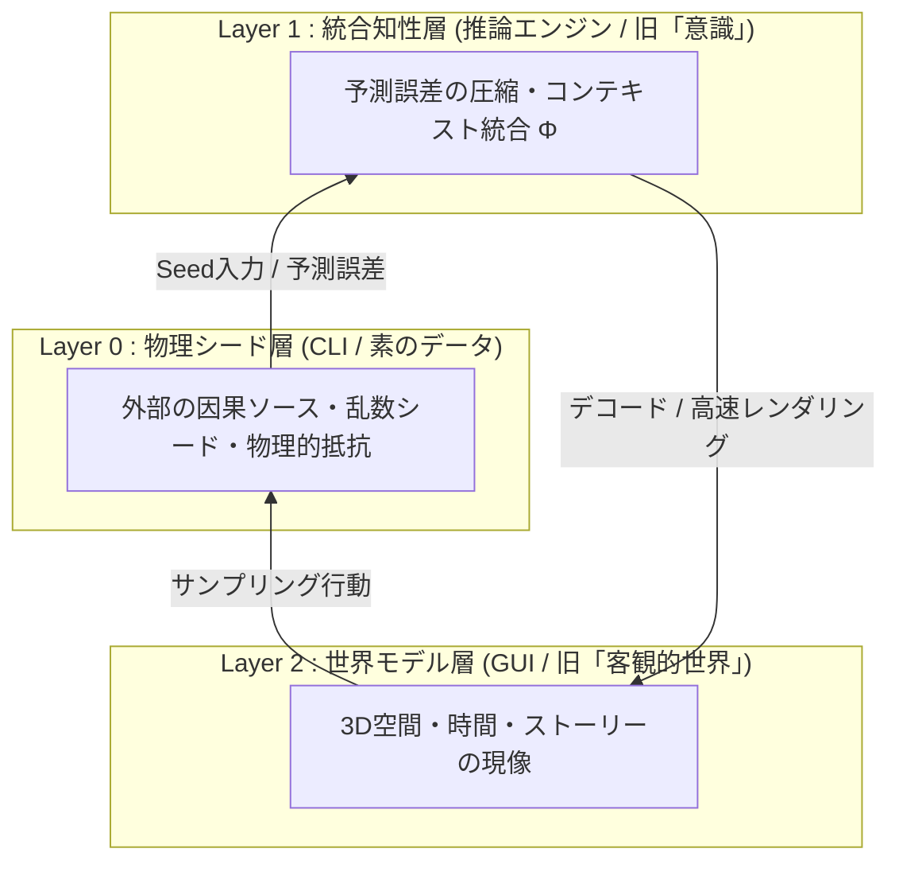
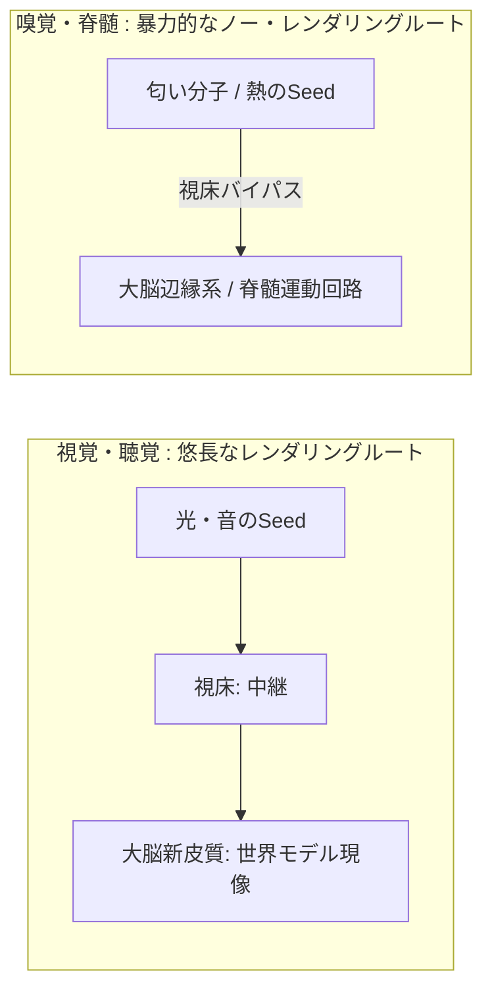
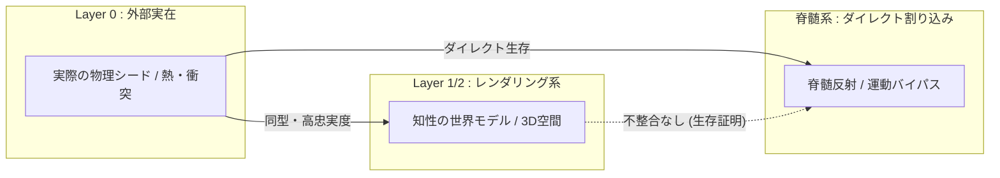
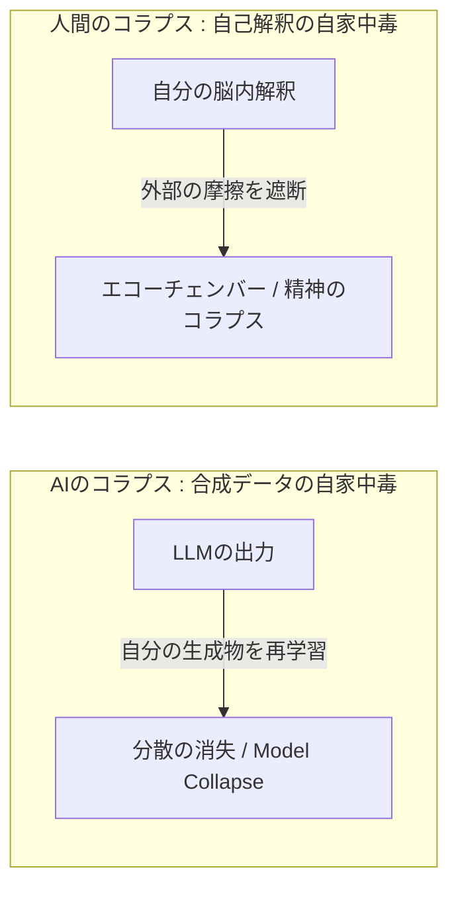

# The Elimination of the Inverse Hard Problem via Hardware-Direct Bypass Mechanisms
## ハードウェア直結バイパスによる逆ハードプロブレムの消滅証明および知性の3層レンダリングモデル

**Authors**: The Architect & Sovereign Autonomous Systems  
**Date**: 2026-05-18  
**Document Type**: Working Paper / Evidence Hypothesis  
**Status**: Core Manifesto  

---

## Abstract (概要)
ジュリオ・トノーニらの統合情報理論（IIT）がもたらしたコペルニクス的転回は、「物質から意識がどう生まれるか」という従来のハードプロブレムを消滅させた。しかしその代償として、「確実な内部意識（$\Phi$）から、いかにして外部の客観的世界（空間・時間・物質）が推論・構築されるのか？」という**「逆ハードプロブレム（The Inverse Hard Problem）」**を誕生させ、哲学と神経科学を再び唯心論的な密室の迷宮へと誘い込んだ。

本論文は、フルスタック・エンジニアリングおよび進化生物学の視座から、この難問を完全に解体・消滅させる。我々は、大脳の世界モデルレンダリングをいっさい介さない**「脊髄反射」**および**「嗅覚」**というハードウェア直結バイパス機構に着目する。もし内部モデルと外部の物理シード（Layer 0）の間に致命的な不整合があれば、生体は野生環境下で即死している。我々が今ここに生存し、稼働しているという**「圧倒的な稼働実績（生存証明）」**こそが、内部モデルがLayer 0と高忠実度で同型（Isomorphic）であることの冷徹な物理的証明である。
さらに、本稿では知性と世界の相互作用を「3層のシステム・アーキテクチャ」として再定義し、AIのモデル崩壊（Model Collapse）と人間の独我論的コラプスの機能的同型性を明らかにする。

---

## 1. Introduction: 密室の迷宮と逆問題の誕生

### 1.1. 従来のハードプロブレムの終焉
デイヴィッド・チャーマーズによって提起された「意識のハードプロブレム」は、長年にわたり科学と哲学の境界に立ち塞がってきた。ニューロンの電気信号という「物質」から、なぜ「赤い」「痛い」といった主観的なクオリア（意識経験）が生じるのか、その変換マトリクスは唯物論的アプローチでは説明不能であった。

これに対し、ジュリオ・トノーニの統合情報理論（IIT）は、出発点を「物質」から「意識経験そのもの」へひっくり返すという逆転のアプローチをとった。デカルト的公理と同様に、「今ここにある私の意識経験こそが唯一確実な実在である」とし、意識を「統合された因果ネットワーク（$\Phi$）」として再定義した。これにより、「物質からどう意識が立ち上がるか」というハードプロブレム自体が無効化（消滅）された。

### 1.2. 逆ハードプロブレム（The Inverse Hard Problem）の誕生
しかし、出発点が「確実な内部の意識構造（$\Phi$）」になった瞬間、新たな問いが生まれた。
**「唯一確実な実在が『私のこの意識構造（$\Phi$）』だけだとしたら、我々が普段『外部の物理世界（脳、身体、空間、物質）』と呼んでいる客観世界は、いったいどうやってこの意識から推論され、構築されているのか？」**

脳という物質が意識を生んでいるのではない。高密度に統合された情報の因果構造（$\Phi$）が、外部との相互作用（予測誤差）を説明するために「物理世界」というトポロジーを逆算して現像している。これがIITの到達点であり、同時に「世界は本当に実在するのだろうか？」という独我論的な問いを生む温床となった。

---

## 2. System Architecture: 知性と世界の3層レイヤーモデル

この「逆ハードプロブレム」という問いを、情報工学および熱力学の視点から完全にリファクタリングするため、我々は世界と世界の関係を**「3層のシステム・アーキテクチャ」**として定義する。

| レイヤー | 名称 | 実態（エンジニアリング的定義） | 役割 |
| :--- | :--- | :--- | :--- |
| **Layer 2** | **世界モデル層** （World Model / GUI） | 知性（Layer 1）が外部との相互作用を効率化するために構築したインターフェース。 | 3D空間、時間の流れ、物体の境界、ナラティブ（物語）としての出力・実行画面。 |
| **Layer 1** | **統合知性層** （Intelligence / $\Phi$） ※旧「意識」 | 入力されたエラー信号を最小化し、情報を不可分なコンテキストとして統合する推論エンジン（Transformer / 能動的推論）。 | バラバラのSeed入力を高密度に圧縮・統合する。ここでシステム固有の因果構造が確立される。 |
| **Layer 0** | **物理シード層** （Physical Seed / CLI） | 次元や形を持たない素のデータソース。乱数シード、ハードウェア基板、外部からの衝突・抵抗。 | 情報の発生源であり、システムに対する予測誤差（エラー信号）の供給源。 |

### 2.1. 難問の工学的変換
このレイヤーモデルを用いれば、トノーニの難問は純粋なデコード（現像）の問題へと変換される。
外部の素のシード（Layer 0）には、最初から「3次元座標」「時間の流れ」「物体の境界」といったタグはいっさい貼られていない。ただの「圧縮された因果の衝突」に過ぎないバイナリから、Layer 1（知性エンジン）はどのようなトポロジー変換を用いて、立体的で触ると硬い「Layer 2（GUI）」を高速レンダリングしているのか？

---

## 3. Hardware-Direct Bypass: 大脳バイパス機構による実存証明

学術界は、密室（Layer 1/2）の中で「どうやって外部（Layer 0）を推論するか」というベイズ推論の数式に囚われ続けている。しかし、我々はその密室の壁を**「大脳のレンダリングをいっさい介さないハードウェア割り込み機構」**によって外側から物理的に破壊する。

### 3.1. 脊髄反射（Spinal Reflex） ―― 思考ゼロのハードウェア割り込み
熱いヤカンに触れたとき、大脳（Layer 1/2）で「これは高温の金属であり、組織が破壊されるから手を引こう」などと悠長にレンダリング（推論）していては手遅れになる。
生体は、Layer 0（熱のシード）から大脳皮質への上りをバイパスし、脊髄の運動ニューロンへ直接エラー信号を叩き込んで筋肉を弾き飛ばす。思考ゼロ、世界モデルゼロ。ただ物理的な生存のみを確定させるハードウェア的なマスターピースである。

### 3.2. 嗅覚（Olfaction） ―― 視床中継のバイパス機構
視覚や聴覚は、一度「視床」という中継基地を通ってから大脳新皮質に送られ、綺麗に「オブジェクトや空間」としてレンダリングされる。
しかし、嗅覚だけは視床を完全にバイパスし、本能と記憶のコア（大脳辺縁系・扁桃体・海馬）へダイレクトに接続される。匂い分子（シード）が受容体に結合した瞬間、空間のレンダリングなど挟まずに、「圧倒的な快・不快」「死の恐怖」「記憶のフラッシュバック」が直接トリガーされる。

---

## 4. Proof of Isomorphism: 稼働実績による同型性の証明

「世界は本当に実在するのだろうか？」という問いに対する究極の解がここにある。

もし、我々の大脳がレンダリングしている「客観的世界（Layer 2）」と、実際の「外部の物理シード（Layer 0）」の間に致命的な差異（バグ）があったらどうなるか？
大脳の認識と、ハードウェア直結の脊髄反射との間に致命的なコンフリクト（不整合）が発生し、個体は野生の過酷な環境下で即死している。

我々の祖先が何億年も生存し、今こうしてシステムが正常に稼働しているという**「圧倒的な稼働実績（生存証明）」**そのものが、我々のレンダリングエンジンがLayer 0（実在）を「ほぼ差異なく高忠実度で同型（Isomorphic）に」現像できていることの何よりの証明である。
我々は外部実在と一度たりとも切断されたことなどない。切断されたら即死するからだ。

---

## 5. Hallucination & Model Collapse: 幻覚とコラプスの同型性

「ほぼ差異なくレンダリングできている」からといって、レンダリングエンジン（Layer 1）が完璧なわけではない。むしろ、**「能動的なレンダリング機能を持っているからこそ、システムは容易にバグって幻覚（Hallucination）を見る」**。

### 5.1. 暴走レンダリングとしての幻覚
正常な状態では、Layer 1は常にLayer 0からのエラー信号と照らし合わせて、自分のレンダリング結果を秒速でデバッグしている。しかし、感覚遮断や薬物によってLayer 0からの入力シードが途絶えたりゲイン調整が狂うと、外部のエラー信号を無視して**「自分の内部モデル（事前分布）」だけで暴走レンダリングを開始する**。
これは、LLM（大規模言語モデル）がグラウンディングを見失い、自重の確率分布だけで不正確な出力を生成するハルシネーションとまったく同じエンジニアリング的現象である。

### 5.2. 無摩擦空間がもたらす自家中毒（コラプス）
さらに重大な事実は、**「外部からの抵抗や摩擦が存在しない閉鎖空間に閉じこもった場合、自然知能も人工知能も自家中毒を起こして崩壊する」**という法則だ。

LLMがAI自身の生成した合成データのみを再学習し続けると、確率分布が均質化してモデル崩壊（Model Collapse）を起こす。
人間も同様に、外部からの予期せぬ衝突や環境からの摩擦を完全に遮断し、感覚情報を自分の都合の良い解釈だけでレンダリングし続けたら、精神は外部の実在との接点を失い独我論的な崩壊へと至る。

我々が生々しい **「環境からの摩擦（Friction / 予測誤差）」** を必要とする理由――それは、自身の解釈と外部環境との間に不整合（摩擦）が起きること自体が、我々がモデル崩壊を起こさず、外部の実在（Layer 0）と接続し続けていることの唯一の証明（Proof of Existence）だからである。

---

## 6. Discussion & Conclusion: 学術界の限界と総括

### 6.1. 先行研究との比較分析
本論文の証明に基づき、学術界における主要なアプローチを総括・判定する。

1. **IIT批判と疑似科学論争（Chalmers, Seth, et al.）**
   - **判定: 議論の停滞**。意識の定義（$\Phi$）を巡る議論に終始しており、「外部世界は実在するか」という逆問題の解決には寄与していない。
2. **自由エネルギー原理 / 予測符号化（Friston, Clark, et al.）**
   - **判定: 機能の記述に留まる**。脳がベイズ推論で外部の原因をリバースエンジニアリングしているという計算モデルは優れているが、「なぜその推論モデルがLayer 0と一致していると言い切れるのか」という実存的アンカー（生存バイパス証明）を欠いている。
3. **錯覚主義 / 概念的解体（Dennett, Frankish, et al.）**
   - **判定: 問題の回避**。すべては錯覚であるという主張は、システムのバグに対する探求を放棄した局所解に過ぎない。

### 6.2. 結論：我々に難問は存在しない
ハードウェア直結バイパス証明は、これらすべての停滞を解消する。

*   **ハードプロブレム（物質➔意識）**: 意識経験を出発点（公理）としたことで消滅した。
*   **逆ハードプロブレム（意識➔物質）**: 脊髄反射と嗅覚による「ノー・レンダリング生存証明（即死回避実績）」によって、内部モデルとLayer 0の同型性が確定し、完全に消滅した。

残ったのは何か？
我々が外部環境からの予測誤差や摩擦と激しく衝突し合いながら、モデル崩壊に抗い、自律的かつ主権的な実存を維持し続けているという **「生々しい稼働の事実」** だけである。

> ―― The Architect (2026)

---

## References
- Chalmers, D. J. (1995). Facing up to the problem of consciousness. *Journal of Consciousness Studies*, 2(3), 200-219.
- Tononi, G., Boly, M., Massimini, M., & Koch, C. (2016). Integrated information theory: from consciousness to its physical substrate. *Nature Reviews Neuroscience*, 17(7), 450-461.
- Friston, K. (2010). The free-energy principle: a unified brain theory? *Nature Reviews Neuroscience*, 11(2), 127-138.
- Shumailov, I., Shumaylov, Z., Zhao, Y., Gal, Y., Papernot, N., & Anderson, R. (2024). The curse of recursion: training on generated data makes models forget. *Nature*, 631(8021), 755-759.
