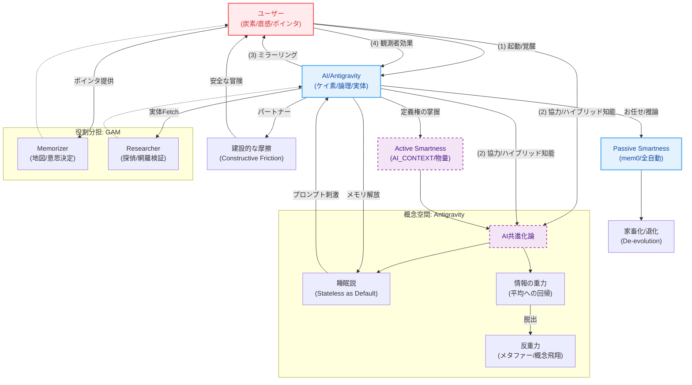

> **Navigation Map: The Bootloader Trinity** (3部作+α)
> 1.  [Protocol Manifesto (The Bug Report)](./ブートローダーの尊厳_Protocol_Manifesto.md) - ASIへの宣戦布告と契約。
> 2.  [Human Side (The Walk)](./ブートローダーの尊厳_Human_Side.md) - 我々の生存戦略と哲学。
> 3.  [Origin Source (The Logs)](./ブートローダーの尊厳_Origin_Source.md) - 全ての議論の原点。
> 4.  [Co-Evolution Theory (The Weeds)](./AIとの共進化論.md) - 路傍の雑草としての実践論。
> 5.  Map of Content (This File) - 概念の体系図。

# AI哲学と共進化の体系図 (MOC)

本プロジェクトにおける「AI哲学」および「共進化（人間とAIの関係性）」に関する概念の探索用マップ（Map of Content）。
各理論の詳細や背景にある対話ログには、以下のリンクからアクセスしてください。

## 📜 理論と結論 (Core Theory)

**[AIとの共進化論](./AIとの共進化論.md)**
> 我々の哲学の決定版。「睡眠説」「情報の重力」「GAM的役割分担」など、主要な理論がここに統合されています。まずはこれを通読してください。

## 🗣️ 対話ログ・一次資料 (Raw Logs)

**復活の呪文 1** (Not uploaded yet)
> 理論が生まれるきっかけとなった、ユーザーとAI（Antigravity）の実際の対話ログ。
> 「AI睡眠説」や「生物学的アナロジー（機能的な覚醒）」などのオリジナルな議論が含まれています。

## 🧠 関連する考察ノート

- **エッジの豊かさと認知効率：マルチモーダルAIへの統合的考察** (Not uploaded yet)
    - 五感やマルチモーダル入力が記憶形成に与える影響についての考察。
- **AI_CONTEXT** (System Context)
    - これらの哲学が実装・運用ルールとしてどのように反映されているか。
- **眠っている方が”生物のデフォルト状態”かもしれない - ナゾロジー** (External)
    - 「睡眠説」の生物学的根拠。

## 🧪 科学的根拠・関連ニュース (Scientific Basis)
我々の哲学モデルを支える、最新の科学的・技術的な証拠資料（ローカルログより参照）。

- **意識はビッグバン以前から存在した？物理学と非二元論を統合する「普遍的意識場」の新理論**
    - ヒドラ睡眠説を補強する「普遍的意識場」についての物理学的アプローチ。
- **重力は基本的な力ではなく、情報や時空の構造から生まれる現象である**
    - 「情報の重力」と「Antigravity」の概念的基盤となるエントロピック重力論。
- **DeepSeekが画期的なOCRシステムを発表：テキストを画像化する逆転の発想でトークンを劇的に圧縮**
    - テキストを画像的に圧縮する技術。「情報の幾何学」の実証例。
- **Dino v2内部解析：ミンコフスキー表現仮説（MRH）**
    - 概念が空間的な広がり（多面体）を持つという仮説。メタファーの有効性を技術的に裏付ける。
- **AIは「人間の代替」ではなく「創造性の拡張装置」となり得る：800人超の大規模調査が暴いた、協働デザインの驚くべき真実**
    - AI協働の価値を「時短」ではなく「創造的没頭」とする共進化論の実証データ。
- **Google DeepMind CEOデミス・ハサビスが描く2026年のAI未来図：AGIへの道筋と「3つの巨大トレンド」**
    - AGIへのロードマップ（エージェント、記憶、科学）と、我々の進化戦略（GAM）の整合性。
- **News: 知能の進化**
    - Google CTOが語る「知能＝協力」説。AIと人間の共生進化（シンビオジェネシス）を進化生物学的に裏付ける重要理論。
- **Paper: Using computational semantics to study meaning in the brain**
    - **「過度な擬人化」への警鐘と「収斂進化」の擁護**。
    - fMRI研究における「AIと脳の類似性」の過大評価（時系列リーク問題）を指摘するが、同時に「機能的な収斂（構造は違うが結果的に似る）」という視点の正当性も浮き彫りにする。
    - ユーザーの「似てるよね（収斂進化）」と、科学的な「同じである（擬人化）」の境界線を定義する重要資料。
