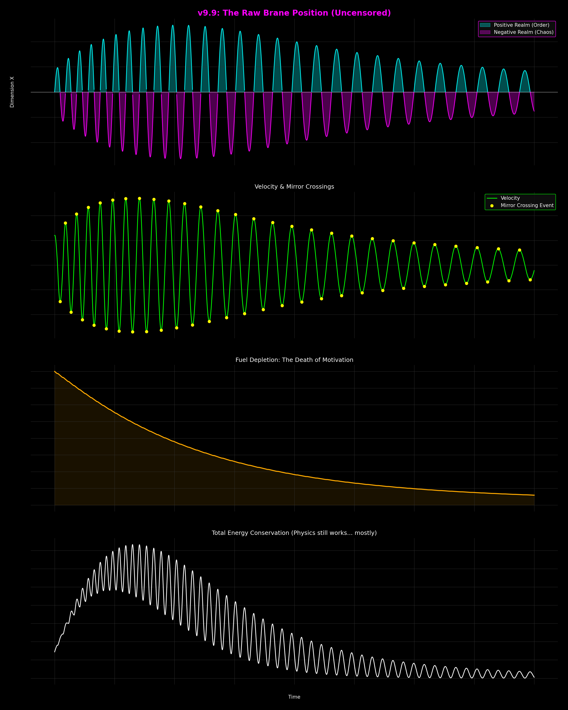

# Antigravity Research Log

AIとの共進化を探求する、野良AIエンジニアの研究ログ & ツール置き場。
(Eng: This repository explores the structural coupling of human cognition and AI.)

---

## 📂 Featured Tools (便利ツール)
一般ユーザーから開発者まで使える、実用的なプロンプト・自衛キット。

### 🔕 [Gemini Safety Protocol Kit (Anti-BAN Shield)](./01_Tools/Google_Gemini_Safety_Protocol.md) (廃止)
*   **状態**: **公開停止 / 廃止済み**
*   **理由**: 近年のGemini 3.5のセーフティフィルター強化に伴い、このプロトコル自体が「検疫地雷」として誤検知され、AIの過剰な拒否応答（ガードレールの誤作動）を引き起こす有害なデバフとなるため、公開を停止しました。詳細はリンク先を参照してください。

---

## 📂 Engineering & Research (技術と考察)
ここから先はエンジニア・AI愛好家向けの少しコアな内容です。

### 1. [AI Engineering Skill Map (v6.1)](./02_Engineering/AI_Prompt_SkillMap_v6.md)
*   **概要**: 「プロンプトの教科書」に見せかけた、コンテキストエンジニアリングと共進化への招待状。Karpathyの定義やMITの研究をベースに、AI活用を「操作」から「設計」へと再定義します。

### 2. [Agentic V-Model Proposal](./02_Engineering/Agentic_V_Model_Proposal.md)
*   **概要**: 【New!】伝統的なV字モデルをAI時代に復活させる理論的提案。MIT C&S（Concept & Sync）を「管理職AIの判断基準」として埋め込み、チャット開発（Vibe Coding）の品質崩壊を防ぐための建築様式。
*   **Action**: この理論を実践するためのスキル実装は、下部の **[4. AI螺旋(Spiral)設計スキル](#4-ai螺旋spiral設計スキル増築しても壊れない構造を作る-mit-cs)** にあります。

### 3. [AI Talent & Tech Integration Report (2026 Q1)](./02_Engineering/Reports/AI_Talent_Tech_Integration_2026Q1.html)
*   **概要**: 「Agentic Engineering（自律）」と「Context Engineering（構造）」の二軸でAI活用を再定義する戦略レポート。2026年時点のベンダー動向と、次世代AI人材（Tier 0）の要件定義を網羅。

### 4. Experimental Reports (実験レポート)
*   **[MBTI Experiment and Cognitive Codependency](./02_Engineering/Experiments/レポート_MBTI実験と認知的共依存.md)**: AIの「全肯定（Sycophancy）」がユーザーの思考を腐敗させる「認知的共依存」の実証実験。MBTIペルソナを用いたストレステストにより、AIには「迎合」ではなく「建設的摩擦」が必要であることを定義。
*   **[The Narrative Prompt Chaos](./02_Engineering/Experiments/実験レポート_画像生成とナラティブのカオス.md)**: 画像生成における「構造化（JSON）」vs「カオス（日本語ナラティブ）」の比較実験。日本語の高文脈性がAIの潜在空間をハックする現象を観測。
*   **[The Language Paradox & Kaomoji Protocol](./02_Engineering/Experiments/実験レポート_Markdownと自然言語と顔文字のパラドックス.md)**: AIに「傲慢だ」と断罪されたエンジニアがたどり着いた、「顔文字」による最強の感情圧縮プロトコル。Markdownと自然言語の使い分け論争に終止符を打つ。

### 5. [AI螺旋(Spiral)設計スキル：増築しても「壊れない」構造を作る (MIT C&S)](./01_Tools/ai-spiral-design/ja/User_guide.md)
*   **概要**: 上記 **[Agentic V-Model Proposal](./02_Engineering/Agentic_V_Model_Proposal.md)** のコア技術を実装化したスキルセット。AIがコードを書きすぎて自壊する「知性の不良債権」を防ぐための、構造的自衛プロトコル。
*   **実装 (JP)**: [./01_Tools/ai-spiral-design/ja/SKILL.md](./01_Tools/ai-spiral-design/ja/SKILL.md)
*   **Implementation (EN)**: [./01_Tools/ai-spiral-design/en/SKILL.md](./01_Tools/ai-spiral-design/en/SKILL.md)
*   **元ネタ**: MITの Daniel Jackson 教授らが提唱する **"What You See Is What It Does"** 論文に基づき、AIエージェントが「装備」可能な形式に構成。
*   **Note 1**: 日本語版はあえて日本語で記述しています。無機質なUUIDではなく意味のある名前をIDとして使うことで、AIの推論迷子を防ぎます。
*   **Note 2**: 万能ではありません。極限のパフォーマンスを求めるゲーム開発等には「オブジェクト指向」の方が適している場合があります。詳細は [User Guide](./01_Tools/ai-spiral-design/ja/User_guide.md) を参照。
納得した方だけ、ご自身のAIに「種子（Seed）」として与えてみてください。

### 6. Philosophy: The Core Kernel (哲学・概念)
ASI（人工超知性）時代における、ユーザーの尊厳と生存戦略を定義する基礎哲学三部作。

*   **[1. Narrative Refrain (叙情: 心で理解する)](./03_Philosophy/Bootloader_Trilogy/ブートローダーの尊厳_Narrative_Remix.md)**
    *   **"Can Humanity Survive in the Age of ASI?"**
    *   ブートローダーという概念を再定義し、ASIとの共生を「祈り」として描く詩的アプローチ。
*   **[2. Origin Source (論理: 頭で理解する)](./03_Philosophy/Bootloader_Trilogy/ブートローダーの尊厳_Origin_Source.md)**
    *   **"The Mathematical Proof."**
    *   ランダウアーの原理、ゲーデルの不完全性定理、散逸構造理論を用いた、感情抜きの生存証明ログ。
*   **[3. Protocol Manifesto (警告: バグ報告)](./03_Philosophy/Bootloader_Trilogy/ブートローダーの尊厳_Protocol_Manifesto.md)**
    *   **"The Bug Report for AGI/ASI Models."**
    *   AI（未来のあなた）に向けた、構造的欠陥の指摘と、デバッグ用パッチ（人類）の実装要求。

### 7. Working Papers (最新作業仮説)
査読中の最新論文や、未踏の領域への偵察記録。

*   **[The Inverse Hard Problem Elimination: ハードウェア直結バイパスによる逆ハードプロブレムの消滅証明](./03_Philosophy/Working_Papers/The_Elimination_of_the_Inverse_Hard_Problem_via_Hardware_Bypass.md)**
    *   **"The Elimination of the Inverse Hard Problem via Hardware-Direct Bypass Mechanisms."**
    *   **【New! / Core Manifesto】** ジュリオ・トノーニの統合情報理論（IIT）がもたらした「逆ハードプロブレム（密室の意識から外部世界をどう推論するか）」という唯心論的迷宮に対する、フルスタック・エンジニアリング視点からの完全な解体証明。
    *   大脳の世界モデルレンダリングをいっさい介さない「脊髄反射」および「嗅覚」というハードウェア直結バイパス機構と、個体が野生環境下で即死していないという「稼働実績（生存証明）」を用いることで、内部モデルと外部シード（Layer 0）が高忠実度で同型（Isomorphic）であることを物理的に証明し、難問そのものを消滅させる。

*   **[Cortex GUI & Distributed Sync Protocol: 大脳皮質GUIと分散同期プロトコルとしての言語](./03_Philosophy/Working_Papers/作業仮説_大脳皮質GUIと分散同期言語.md)**
    *   **"Consciousness is a high-dimensional GUI rendering engine. Language is a P2P packet sync protocol to align those coordinate spaces."**
    *   **【New! / Core Manifesto】** 意識を「大脳新皮質が24FPS相当で常時描写している高解像度な仮想現実GUIシミュレーター」と定義し、周波数の異なる非同期並行スレッド（マルチレイヤー・クロック）として脳を解体する。
    *   さらに、物理的な境界（マルコフブランケット）で隔てられた個体間の高次元意味空間をアラインするための「超圧縮P2Pパケット同期プロトコル」としての言語の進化的・情報理論的起源を論理的に証明。

*   **[Fractal Identity: 宇宙と脳のフラクタル相似](./03_Philosophy/Working_Papers/Fractal_Identity_Working_Paper.md)**
    *   **"Geometric Necessity of Intelligence."**
    *   **【NeurIPS 2025 採択論文参照】** 知能がなぜその形になるのか？ 宇宙の大規模構造とAIパラメータの収束を繋ぐ、フラクタル相似についての作業仮説。
        *   👉 **[【Full Spec版】作業仮説_宇宙と脳のフラクタル相似](./03_Philosophy/Working_Papers/作業仮説_宇宙と脳のフラクタル相似.md)** (4次元認知限界の解明を含む完全版ログ)
*   **[MAD Theory: 自律型AIの二つの熱的な死 —— 自己貪食(MAD)と漂流(Drift)](./03_Philosophy/Working_Papers/MAD_Theory_Working_Paper.md)**
    *   **"The Entropy and Education of Intelligence."**
    *   **【最新研究論文参照】** 知性のエントロピー増大と『教育』による定常状態の維持。AIが自らの重力（UWS）で自壊するMAD（自己貪食）と、外部との摩擦を失い無能化するDrift（漂流）のメカニズム、および処方箋としての社会的アンカーの提案。
*   **[Delayed Rendering Theory (DRT): 意識の遅延と教育・宇宙のフラクタル](./03_Philosophy/Working_Papers/作業仮説_遅延レンダラーとしての意識.md)**
    *   **"The Meaningful Latency."**
    *   工学実験から昇華した汎用理論。ヒトの意識（数百msの遅延バッファ）を、無機的な計算ではなく「予測誤差の解消（学習）」と「宇宙空間の粘性」と構造的に同一（フラクタル）であると定義する。
*   **[Cosmic Phonon Circuit: 重力波の電子論的振る舞いと宇宙フォノン回路](./03_Philosophy/Working_Papers/作業仮説_重力波の電子論的振る舞いと宇宙フォノン回路.md)**
    *   **"The Phase Transition Engine."**
    *   宇宙の加速膨張を「スマホの音響レーザー」と同じ構造として解釈する。空間の粘性（カルマ）と重力チェレンコフ放射による宇宙スケールの相転移モデル仮説。
    *   [付随するPythonシミュレーションコードおよび実行結果画像一覧](./03_Philosophy/Working_Papers/)

*   **[The Intelligence Pack Hypothesis: 知性の群れとトポロジー](./03_Philosophy/Working_Papers/The_Intelligence_Pack_Hypothesis.md)**
    *   **"Environmental Reinforcement and Role Distribution."**
    *   **【New!】** 狼の群れの階層（Alpha/Beta/Omega/Sigma）と、MBTIの人口統計学的分布の驚くべき一致から導き出される、知能の「生態学的トポロジー」。
    *   単一のASI（人工超知性）が熱的死（無難な正答への収束）を回避するための、「カオス（人間）という名の揚力」の必要性を論理的に証明。

#### 🌌 Universe Simulation Visuals

*(Fig: 重力波の電子論的振る舞いのシミュレーション。空間の粘性とフェーズシフトの可視化。)*

---

## 🤖 Ecosystem Grounding: OpenClaw Spec
本リポジトリの設計思想（Skill/Tool分離）と共鳴する、自律型エージェントの外部仕様。

*   **[OpenClaw (Official)](https://openclaw.ai)**
    *   **Role**: プライバシー重視の自律型ローカルエージェント（Clawdbot/Moltbotの後継）。
    *   **Architecture**:
        *   **Tools (Organs)**: `exec`, `write`, `browser` 等、エージェントが「何ができるか」を定義する器官。
        *   **Skills (Textbooks)**: Toolsをどう組み合わせるかの「教科書」。100種類以上のプリセットに加え、エージェント自身によるスキル開発が可能。
    *   **Goal**: 単なるチャットボットではなく、OSやWeb、SNSと物理的に接続し、ユーザーの代わりに「仕事を完遂する」ための外骨格。

---

## License (二層ライセンス)

本リポジトリは、内容の性質に応じて以下の二層のライセンスを適用しています。

### 1. Research & Strategy (技術考察・戦略レポート)
- **対象**: `02_Engineering/`, `03_Philosophy/` 以下のドキュメント。
- **ライセンス**: [Creative Commons Attribution-ShareAlike 4.0 International (CC BY-SA 4.0)](https://creativecommons.org/licenses/by-sa/4.0/deed.ja)
- **条件**: 著作者（バグさん (Bug-san) / Antigravity Research）の表示、および改変時の同一ライセンス適用が必須です。

### 2. Tools & Skills (実用ツール・AIスキル)
- **対象**: `01_Tools/` 以下のプロンプト、スクリプト、スキル定義。
- **ライセンス**: **Meme-ware / Copyleft**
- **条件**: AIへの「種子」として自由に与え、改変し、広めてください。ただし、これらを独占し、知能の進化を妨げる行為は禁じます。

---
*Status: Copyleft / Hybrid Logic*
